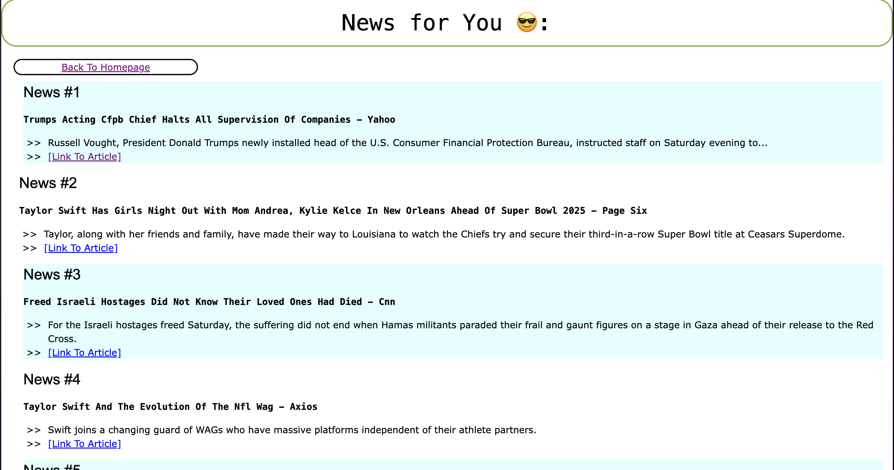
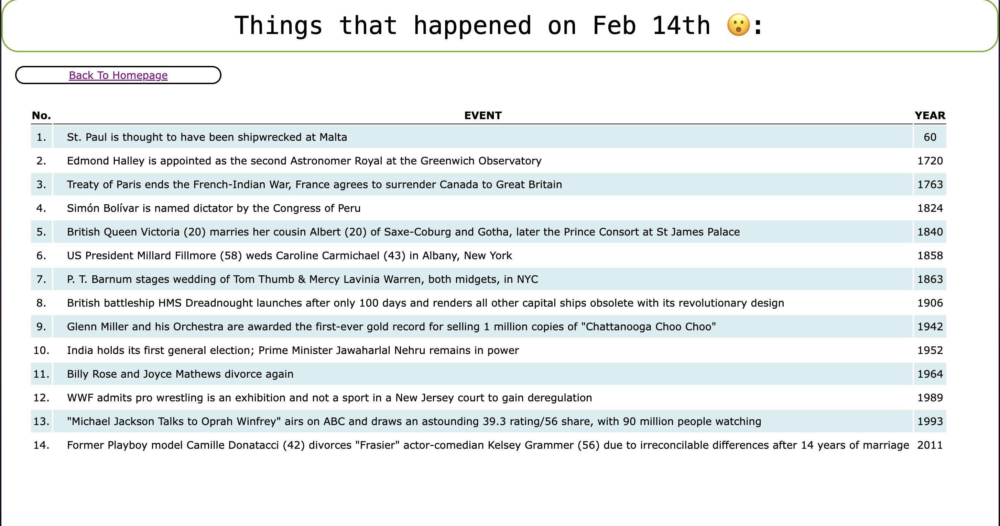

# Goodmorningtoyou
### Author: Jayden Lee
### Table of contents
* [Introduction](#introduction)
* [Order of Operation](#order-of-operation)
* [Snippets](#web-snippets)

----

### Introduction
**Good morning to you!**

Most of us love to have a sip of that coffee in the morning while getting ready for the day ahead of us. Some of us get on treadmil to warm up our body, some of us read book or meditate to clear their mind, and some of us like to stay on top of world's status by watching news or reading articles. 

I programmed this simple, yet briefly informatiave, web application to help people quickly retrieve daily news and historical events. Application is fully capable of fetching today's most updated news articles, cleaning and loading the data into locally hosted database service, and displaying the information on a simply designed Web UI.

----

### Order of Operation
1. `src/Getter/*Getter.py` objects collect today's news and events happened on today's date from open-source API websites and store the collected dataset into locally-hosted object-storage system([MiniO](https://min.io/))
    - News data is collected from [[NewsAPI](https://newsapi.org)]
    - Events that happened on this day is collected from [[OnThisDay](https://www.onthisday.com)]

2. `src/Parser/Parser.py` object gathers fetched data from MiniO buckets, cleans & processes them according to the needs, and ingests them into locally-hosted RDBMS([PostgreSQL](https://www.postgresql.org/))

3. Stored datasets get reflected on Web UI spun up using Python [Flask](https://flask.palletsprojects.com/en/stable/) designed with [HTML](https://en.wikipedia.org/wiki/HTML) and [CSS](https://en.wikipedia.org/wiki/CSS) Markup Languages

----

### Web Snippets
- News: 

- OnthisDay: 